== Accessing the Web UI

=== Logging to the Apiman administration

1. Open the http://localhost:8080/apiman-manager[Apiman UI] in your browser.
2. Login with username as *admin* and password as *admin123!*.
3. Click *Log in*.
+
NOTE: Change the password after the first login.
+
API Management page opens.

=== Creating a user for an API provider
1.	To create a user for an API provider, logout from the admin account in the API Manager UI.
+
The login dialog opens.
+
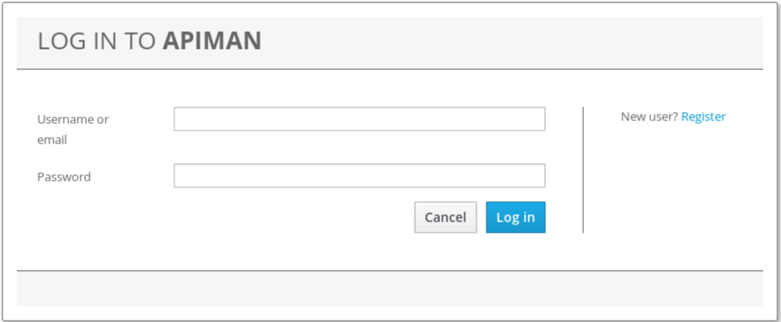

2.	Select *New user* to register the API provider user.
+
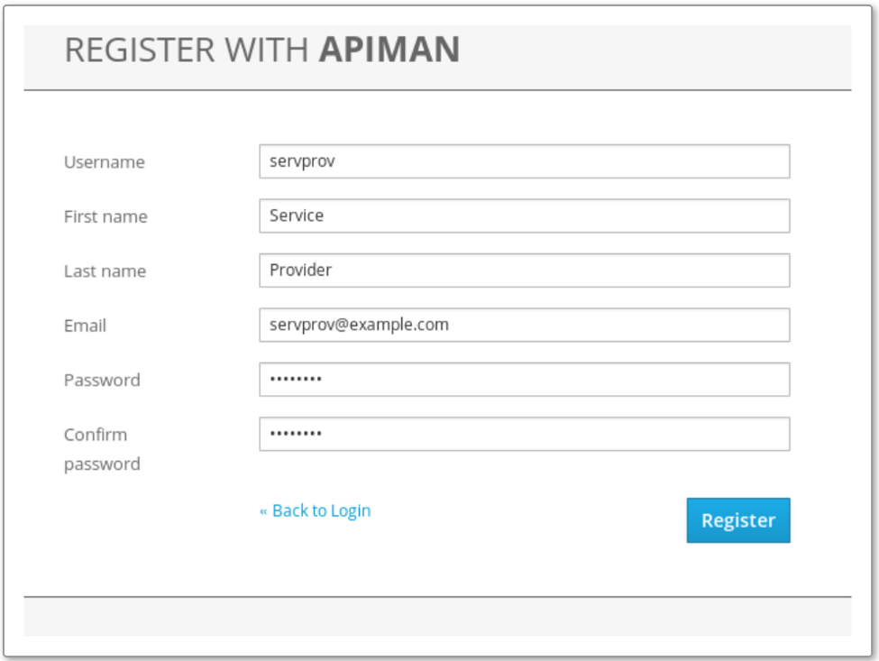
3. Fill in the required field and then click *Register*.

=== Creating an organization [[create-org]]
1.	On the API Management page, select *Create a New Organization*.
+
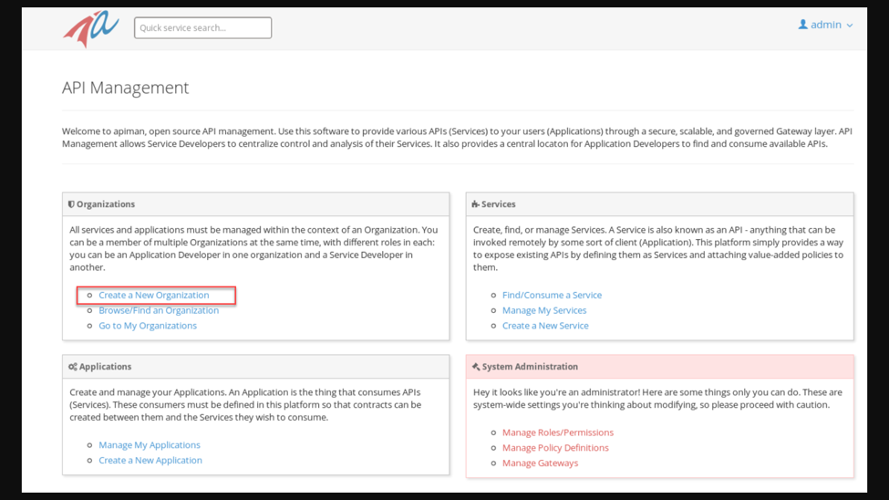

2.	Fill in an *Organization Name* and *Description* fields.
+
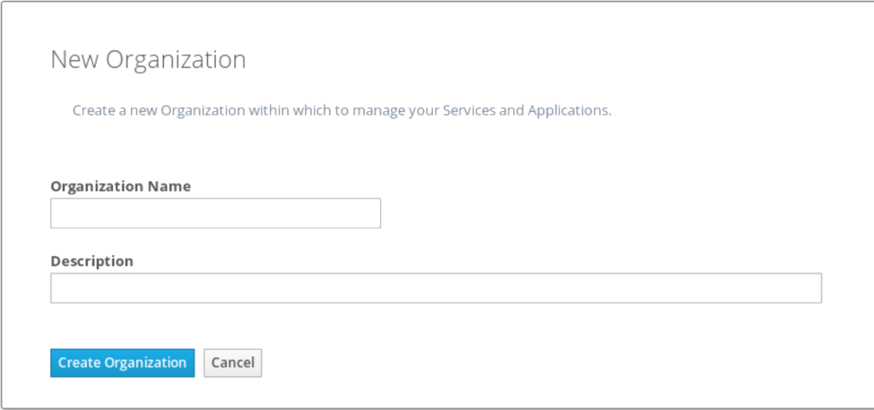

3.	Click *Create Organization* to open your new organization page.

=== Creating a plan for an organization
1.	Select the *Plans* tab to create a new plan.
+
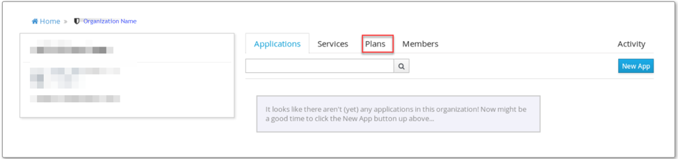

2.	On the New Plan page, fill out the required details.
+
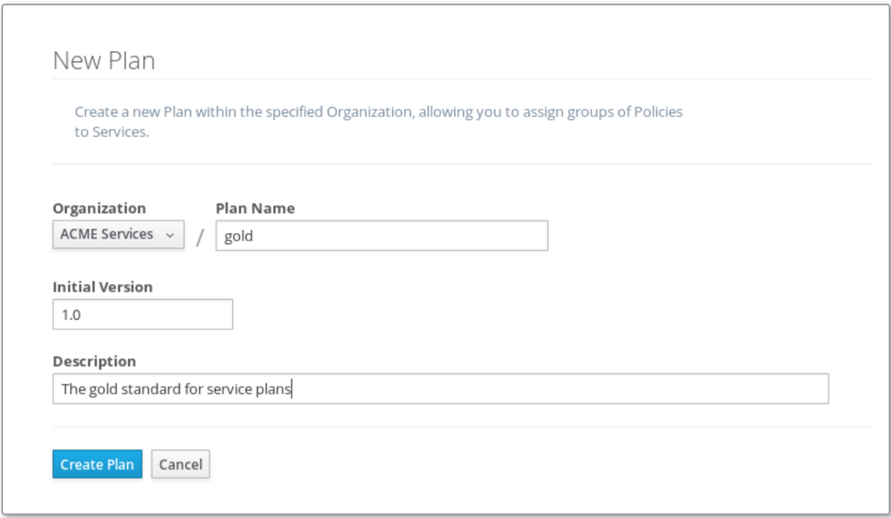

3.	Click *Create Plan*.

=== Creating a policy to plan

1.	Click *Add Policy* to add a policy to the plan.
+
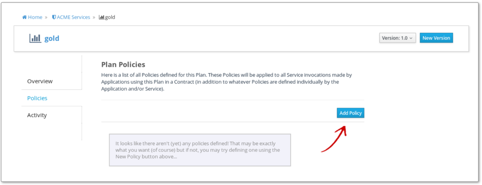

2.	On the Add Policy page, fill out the required details.
+
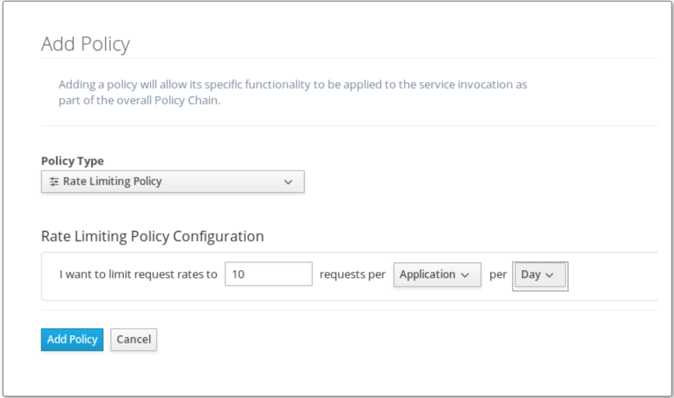
3.	Click *Add Policy*.
4.	After the Policy is created, click *Lock Plan* to lock the plan.
+
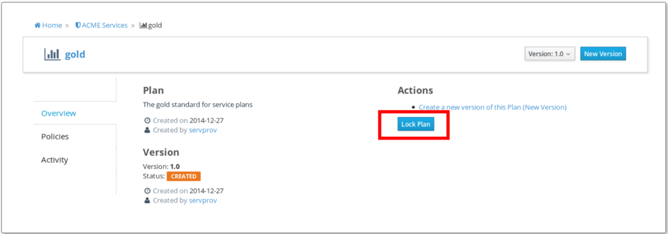
+
The locked plan opens as displayed:
+
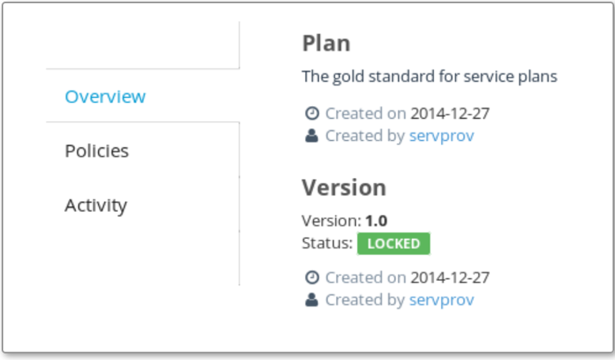

=== Add an API
1.	On the organization page, select the *Services* tab and click *New Service* to define an API.
+
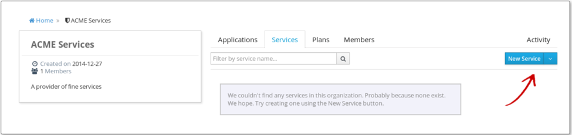
2.	On the New Service page, fill out the required details.
+
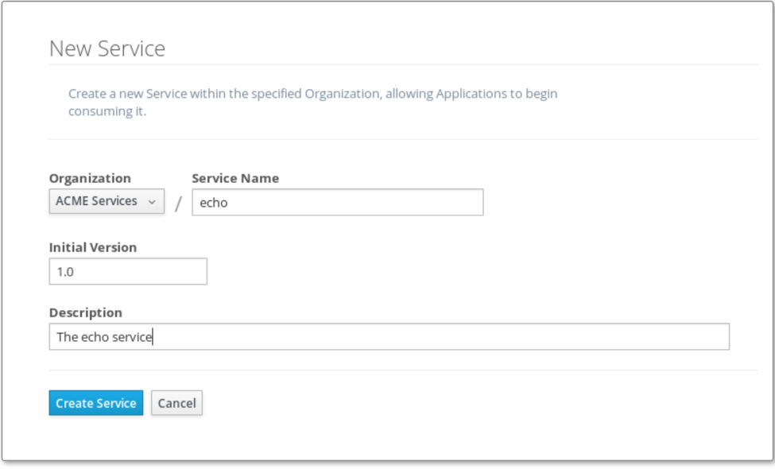
3.	Click *Create Service*.
4.	Define API implementation:

.. On the *Implementation* tab, fill out the API Endpoint field as http://localhost:9999/apiman-echo
+
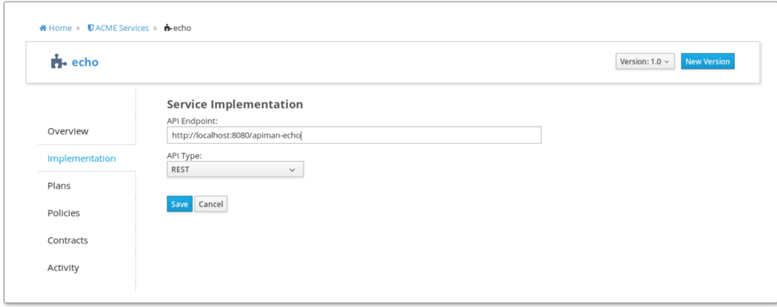

.. Click *Save*.
5. Select the *Plans* tab, and then select a required plan.
+
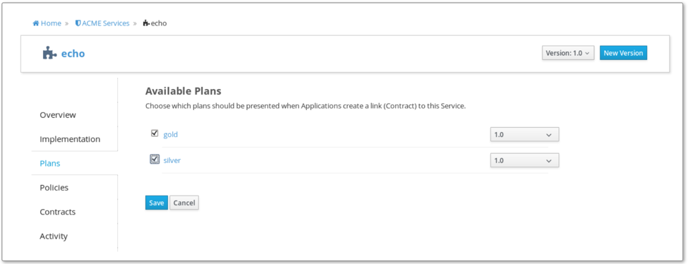
6. Click *Save*.

7.	Select the *Policies* tab, and then define an authentication policy.

8.	After the authentication policy is added, click *Publish* to publish the API to the API Gateway.

+
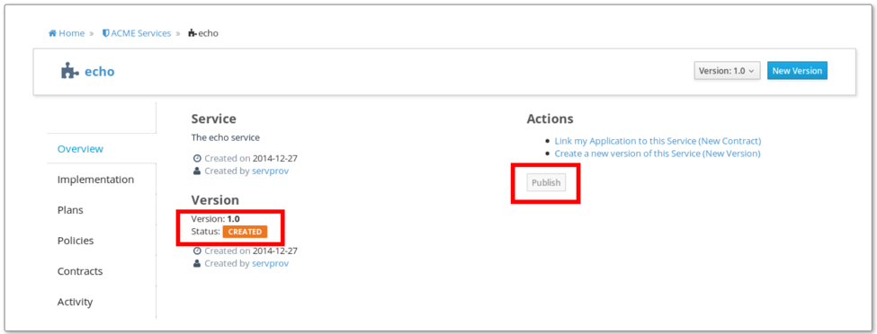

9.	The status of the API changes to *PUBLISHED*, which means that the created API is now available.
+
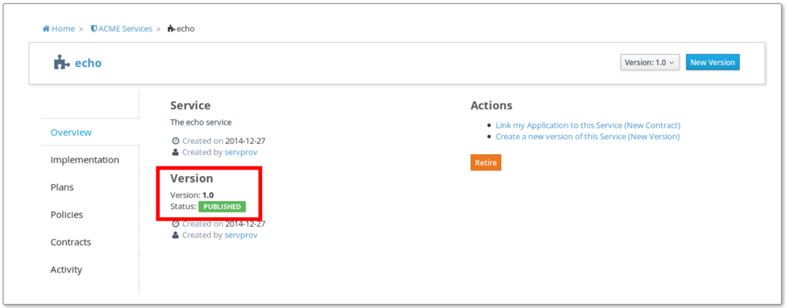

=== Configuring user for an API consumer

1.	To create a user for an API consumer, logout from the API Provider account in the API Manager UI.
+
The login dialog opens.
+

2.	Select *New user* to register a new client app developer user.
+
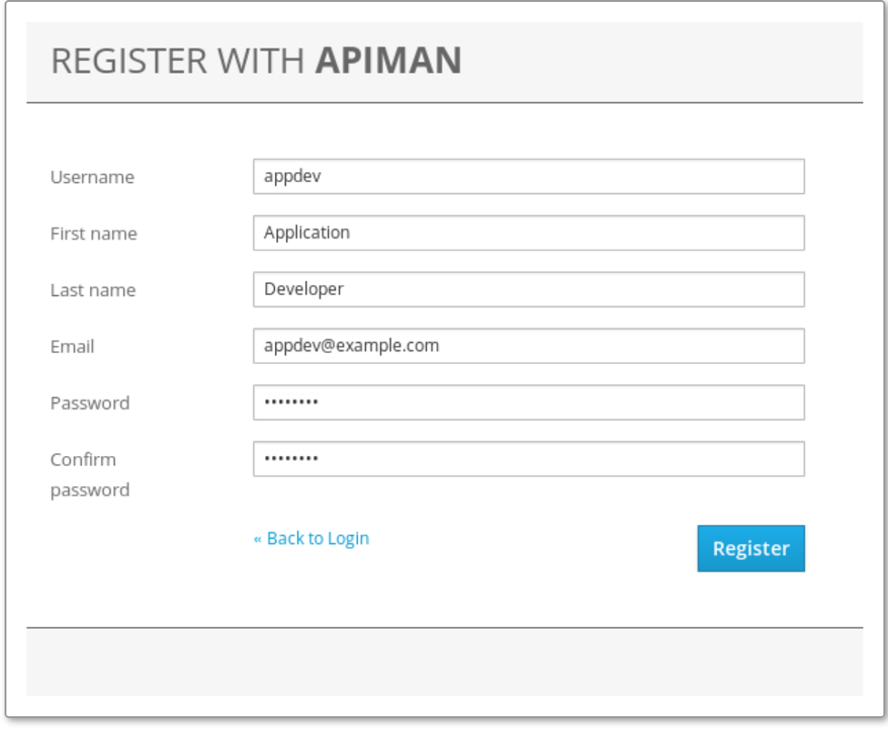
3. Fill in the required field and then click *Register*.

=== Creating an organization
Create an organization for an API consumer. For more information about creating an organization, see <<create-org, Creating an organization>>.

=== Assigning a plan
1.	Click *Search for Services to consume* to search for the API to be used by the client app.
+
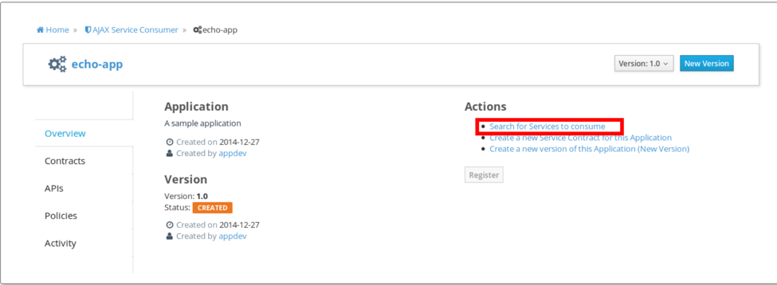

2.	Type the API name on the *Search* box. Matching services appear on the bottom left of the UI.
+
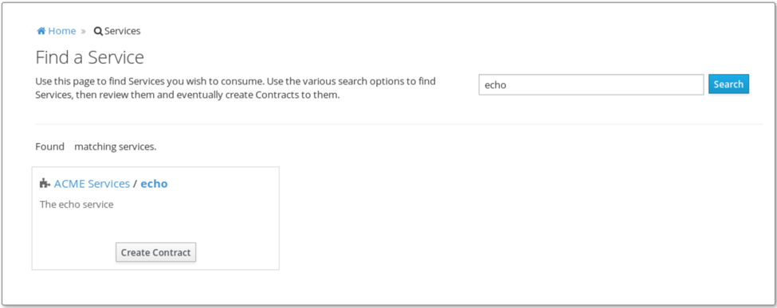

3.	Select the API name, and then specify the plan to use.
+
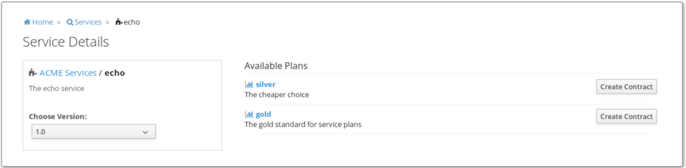
4.	Click *Create Contract*.
+
New Contract page opens.
5. Fill the required details and then click *Create Contract*.
6. Click *I Agree* to accept the contract terms.
+
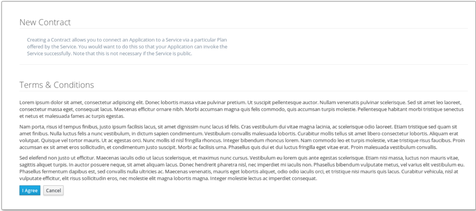
7.	Click *Register*.
+
NOTE: Apiman will generate a unique key, which a consumer can use to access the private API.
+
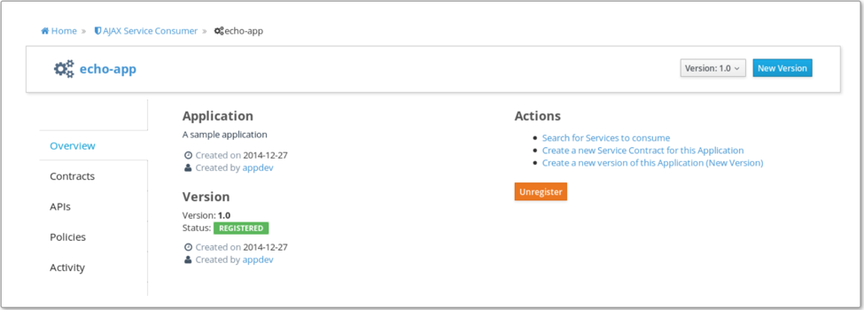

 
