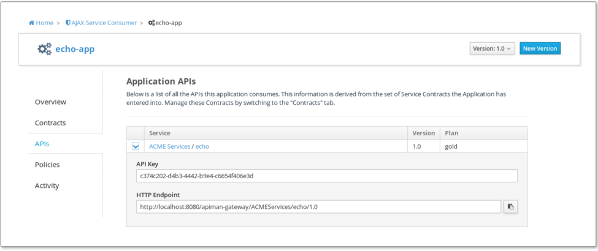

== Testing the usage policy
On the Consumer page, select the APIs tab, where you can copy the API key and the location of the HTTP endpoint.

=== Basic response
To check that you can get through to the Echo service, which was made private and is proxied by the Apiman, use the Apiman-provided endpoint and append a regular Echo service path, for example:
[listing]
curl -k -H "X-API-Key: 81430d0e-8f62-46d4-822b-167edda1ed7f" -X GET https://localhost:8443/apiman-gateway/EchoOrganization/EchoAPI/1.0/hello
{
  "method" : "GET",
  "resource" : "/apiman-echo/hello",
  "uri" : "/apiman-echo/hello",
  "headers" : {
    "Accept" : "*/*",
    "User-Agent" : "curl/7.55.1",
    "Connection" : "keep-alive",
    "Host" : "localhost:9999",
    "Accept-Encoding" : "gzip"
  },
  "bodyLength" : null,
  "bodySha1" : null
}

=== Quota information
To check the quota consumption, view the response headers, for example:
[listing]
curl -k -H "X-API-Key: 81430d0e-8f62-46d4-822b-167edda1ed7f" --head https://localhost:8443/apiman-gateway/EchoOrganization/EchoAPI/1.0/hello

[listing]
HTTP/1.1 200 OK
X-Powered-By: Undertow/1
X-Quota-Remaining: 6
Server: WildFly/10
Server: Jetty(9.3.0.v20150612)
X-Quota-Limit: 10
Date: Thu, 26 Jul 2018 22:37:57 GMT
X-Quota-Reset: 84122
Connection: keep-alive
Content-Type: application/json
Content-Length: 320

 
